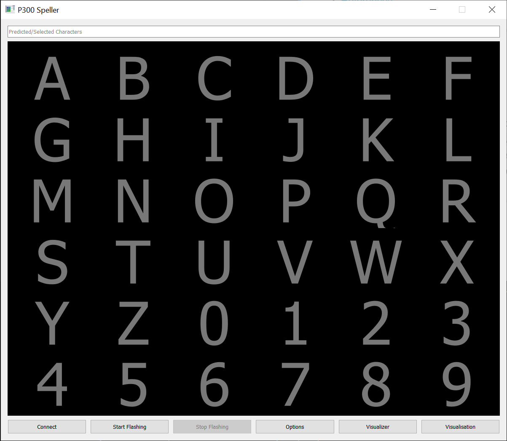
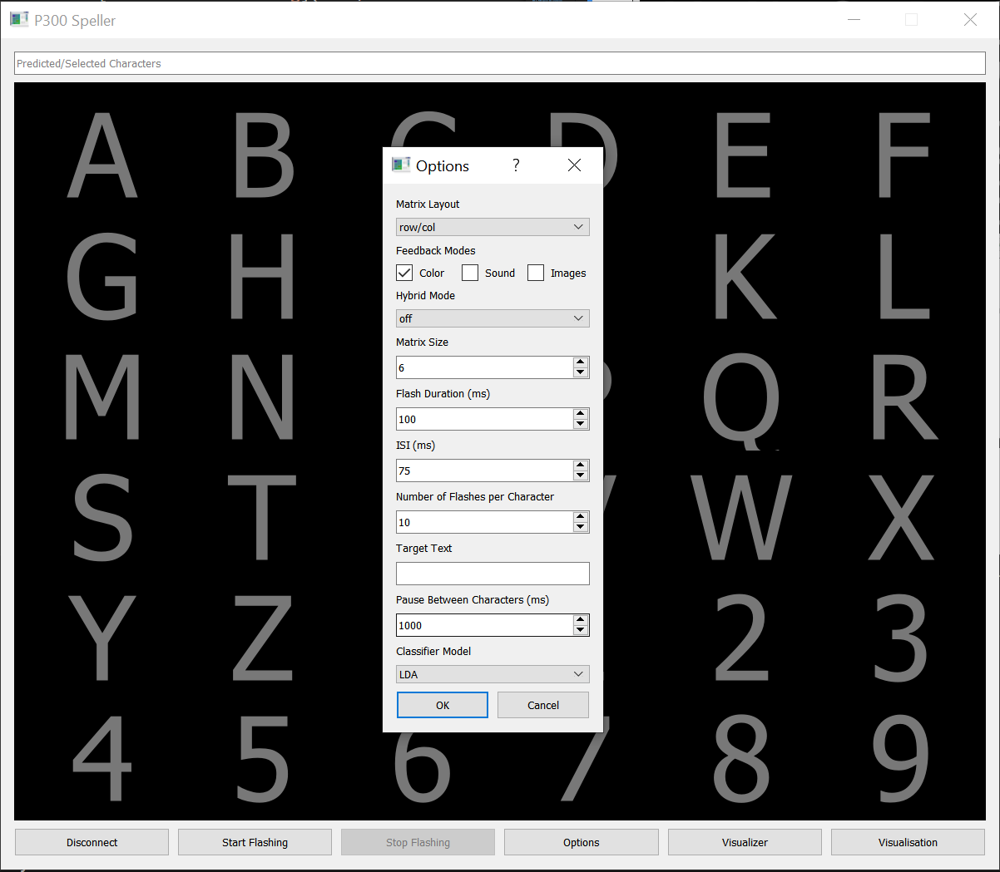
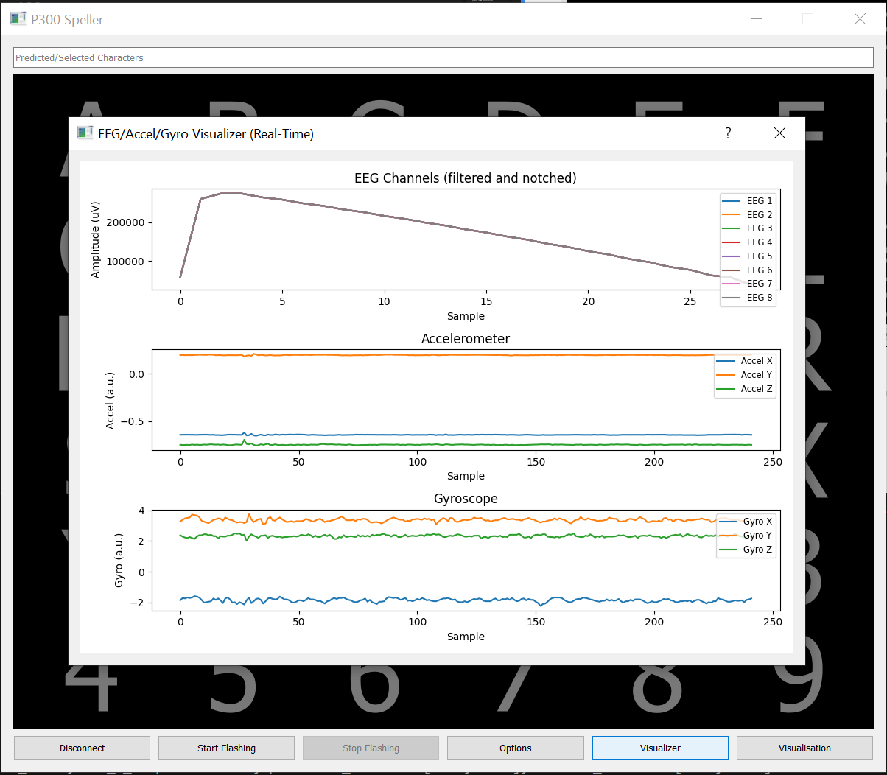

# BCI-Unicorn-Hybrid-Black_P300_Speller

A real-time P300 Speller BCI system for the Unicorn Hybrid Black EEG device. Enables text input via brainwave analysis by detecting P300 event-related potentials (ERPs) in response to user attention on a visual character matrix.

---

## Key Features
- **Real-time P300 detection** (250–500 ms post-stimulus)
- **Low-latency signal processing pipeline**: Filtering, artifact removal, epoching, feature extraction
- **Flexible GUI**: Matrix-based speller with customizable paradigms
- **High-accuracy classification**: LDA, SVM, and optional 1D CNN
- **Visualization tools**: ERP, topomaps, confusion matrices
- **Extensive documentation and unit tests**

---

## Requirements & Installation
- Python 3.8+
- [MNE-Python](https://mne.tools/), [scikit-learn](https://scikit-learn.org/), [PyQt5](https://pypi.org/project/PyQt5/), [joblib](https://joblib.readthedocs.io/), [numpy](https://numpy.org/), [matplotlib](https://matplotlib.org/), [seaborn](https://seaborn.pydata.org/)
- For device use: Unicorn Hybrid Black SDK/driver
- Install dependencies:
  ```pwsh
  python -m pip install -r requirements.txt
  # Or install manually as needed
  ```

---

## High-Level System Diagram

- **unicorn_connect.py**: Handles device connection and streaming.
- **eeg_preprocessing.py**: Cleans, filters, and epochs EEG data.
- **eeg_features.py**: Extracts features from each epoch.
- **eeg_classification.py**: Trains and evaluates classifiers.
- **realtime_bci.py**: Orchestrates real-time loop, integrates all modules.
- **p300_speller_gui.py**: GUI for stimulus presentation and feedback.
- **eeg_visualization.py**: Visualization of ERPs, topomaps, and classifier results.

---

## Example Command-Line Usage

### 1. Device Connection & Data Acquisition
```pwsh
python .\unicorn_connect.py
```

### 2. Preprocessing & Feature Extraction (batch/offline)
```python
# Example in Python shell or script:
from eeg_preprocessing import EEGPreprocessingPipeline
from eeg_features import extract_features
# eeg_data_uV, events, ch_names = ...
pipeline = EEGPreprocessingPipeline(sampling_rate_Hz=512)
cleaned = pipeline.bandpass_filter(eeg_data_uV)
# ...continue with pipeline methods...
features = extract_features(epochs_X, 512)
```

### 3. Model Training & Evaluation
```pwsh
python .\eeg_classification.py
```

### 4. Visualization
```pwsh
python
>>> from eeg_visualization import plot_erp, plot_topomap, plot_confusion_and_metrics
>>> # Use with your data/labels
```

### 5. P300 Speller GUI (standalone)
```pwsh
python .\p300_speller_gui.py
```

### 6. Real-Time BCI (full pipeline)
```pwsh
python .\realtime_bci.py
```

### 7. Run All Unit Tests
```pwsh
python -m unittest discover -s tests
```

---

## Quick-Start Guide: Minimal Working Example

1. **Simulate or Load Sample Data**
   - Use the provided test scripts or generate synthetic data:
   ```python
   import numpy as np
   from eeg_preprocessing import EEGPreprocessingPipeline
   from eeg_features import extract_features
   from sklearn.discriminant_analysis import LinearDiscriminantAnalysis
   # Simulate 10 epochs, 8 channels, 256 samples each
   X = np.random.randn(10, 8, 256)
   y = np.array([0,1]*5)
   pipeline = EEGPreprocessingPipeline(sampling_rate_Hz=256)
   X_proc = np.array([pipeline.bandpass_filter(epoch) for epoch in X])
   feats = extract_features(X_proc, 256)
   clf = LinearDiscriminantAnalysis().fit(feats, y)
   print('Accuracy:', clf.score(feats, y))
   ```
2. **Train and Save a Model**
   ```python
   import joblib
   joblib.dump(clf, 'lda_model.joblib')
   ```
3. **Launch the GUI**
   ```pwsh
   python .\p300_speller_gui.py
   ```
4. **Run Real-Time BCI (with real or simulated device)**
   ```pwsh
   python .\realtime_bci.py
   ```

---

## Documentation
- [System Overview](docs/overview.md)
- [Signal Processing Pipeline](docs/signal_processing.md)
- [P300 Detection & Classification](docs/classification.md)
- [GUI Usage Guide](docs/gui_usage.md)
- [Real-Time Processing](docs/realtime_processing.md)
- [Troubleshooting & FAQ](docs/troubleshooting.md)
- [References](docs/references.md)

---

## Screenshots








---

## Known Limitations
- Real-time performance depends on hardware and OS scheduling; latency may vary.
- ICA artifact removal is not performed in real-time (only batch/offline).
- SSVEP hybrid mode is a placeholder; actual SSVEP detection/classification is not implemented.
- The system is tested primarily on Windows; Linux/Mac support may require minor adjustments.
- Unicorn Hybrid Black device is required for real EEG acquisition; use `generate_sample_data.py` for simulation/testing.

---

## Troubleshooting & FAQ

**Q: The GUI does not launch or crashes on startup.**
- Ensure PyQt5 is installed: `python -m pip install pyqt5`
- Try running with administrator privileges if you see permission errors.

**Q: I get `NotFittedError` or model not found errors.**
- Train and save a classifier using `eeg_classification.py` before running real-time BCI.
- Ensure `lda_model.joblib` is present in the project directory.

**Q: No EEG device found or connection fails.**
- Make sure the Unicorn Hybrid Black is powered on and connected.
- Check USB/Bluetooth drivers and permissions.
- Try restarting your computer and the device.

**Q: Real-time feedback is slow or unresponsive.**
- Close other CPU-intensive applications.
- Reduce matrix size or increase ISI/flash duration in the GUI settings.

**Q: How do I use my own data?**
- Replace `sample_eeg_data.npz` with your own `.npz` file (with keys `X`, `y`, and `sampling_rate_Hz`).
- Adjust configuration in `config.json` as needed.

**Q: How do I contribute or report bugs?**
- Open an issue or pull request on GitHub.

---

## Data Format for Training and Real-Time Operation

- **EEG Data (for training and testing):**
  - File format: `.npz` (NumPy compressed)
  - Keys:
    - `X`: shape `(n_epochs, n_channels, n_samples)` — EEG epochs (microvolts)
    - `y`: shape `(n_epochs,)` — labels (0=non-target, 1=target)
    - `sampling_rate_Hz`: scalar (e.g., 256 or 512)
  - Example: see `sample_eeg_data.npz` (generated by `generate_sample_data.py`)
- **Real-Time Operation:**
  - The system expects continuous EEG data from the Unicorn Hybrid Black device (via BrainFlow/BoardShim), segmented into epochs in real time based on stimulus timing.
  - Channel order and count should match the configuration (see `config.json`).

---

## References and Algorithms

- **P300 Detection:**
  - Filtering, epoching, and baseline correction as in [Krusienski et al., 2006](https://ieeexplore.ieee.org/document/1646518)
  - Feature extraction: time-domain, frequency-domain, time-frequency (DWT, STFT), and spatial (CSP) features
  - Classifiers: Linear Discriminant Analysis (LDA), Support Vector Machine (SVM), 1D CNN
  - For P300 speller paradigms: [Farwell & Donchin, 1988](https://www.sciencedirect.com/science/article/abs/pii/0167876088901052)
  - For hybrid P300+SSVEP: [Pan et al., 2011](https://www.sciencedirect.com/science/article/pii/S1388245711000992)
- **Toolboxes and Libraries:**
  - [MNE-Python](https://mne.tools/)
  - [BrainFlow](https://brainflow.org/)
  - [scikit-learn](https://scikit-learn.org/)
  - [PyWavelets](https://pywavelets.readthedocs.io/)

---

## How to Cite
If you use this codebase in academic work, please cite as:
```
@misc{bci_unicorn_p300_speller,
  title={BCI-Unicorn-Hybrid-Black P300 Speller},
  author={Your Name},
  year={2025},
  howpublished={\url{https://github.com/bneiG1/BCI-Unicorn-Hybrid-Black_P300_Speller}}
}
```

---

# Expanded System Documentation

## High-Level Signal Processing Flowchart

```
EEG Acquisition (Unicorn Hybrid Black)
    ↓
Preprocessing
    - Bandpass filter: 0.1–30 Hz (elliptic)
    - Notch filter: 50 Hz (powerline)
    - Downsampling: 512 Hz → 30 Hz (optional)
    - ICA artifact removal (offline)
    ↓
Epoching
    - Window: -200 ms to 800 ms around stimulus
    - Baseline correction: pre-stimulus interval
    ↓
Feature Extraction
    - Time-domain: mean, variance, entropy
    - Frequency-domain: log bandpower (delta, theta, alpha, beta)
    - Time-frequency: DWT, STFT
    - Spatial: CSP (optional)
    ↓
Classification
    - LDA (default), SVM, 1D CNN (optional)
    ↓
GUI Feedback
    - Visual feedback (color, highlight)
    - Real-time character selection
```

**Key Parameters:**
- Bandpass: 0.1–30 Hz (elliptic, order 4)
- Notch: 50 Hz (Q=30)
- Epoch window: -0.2 to 0.8 s
- Downsample: 512 Hz → 30 Hz (optional)
- Features: mean, variance, entropy, log bandpower, DWT, STFT
- Classifier: LDA (default)

---

## Channel Configuration: Unicorn Hybrid Black

| Index | Channel | Electrode Position |
|-------|---------|--------------------|
| 0     | Fp1     | Frontal pole left  |
| 1     | Fp2     | Frontal pole right |
| 2     | C3      | Central left       |
| 3     | C4      | Central right      |
| 4     | Pz      | Parietal midline   |
| 5     | O1      | Occipital left     |
| 6     | O2      | Occipital right    |
| 7     | Fz      | Frontal midline    |

- **Mapping in unicorn_connect.py:**
  - `eeg_names = ['Fp1', 'Fp2', 'C3', 'C4', 'Pz', 'O1', 'O2', 'Fz']`
  - Channel indices from BrainFlow: `BoardShim.get_eeg_channels(BoardIds.UNICORN_BOARD.value)`
  - Data array: `data[ch, :]` where `ch` is the index above

---

- **Factors affecting latency:**
  - Number of trials per character (averaging improves SNR but increases delay)
  - CPU load and background processes
  - USB/Bluetooth transmission delays
  - Real-time plotting/visualization overhead

---

# Tutorials for Non-Standard Use Cases

## 1. Hybrid P300+SSVEP Mode with Motion Artifact Compensation

**Overview:**
- The system can be extended to detect SSVEP (Steady-State Visual Evoked Potentials) in addition to P300, enabling hybrid BCI paradigms.
- Use the Unicorn’s built-in accelerometer/gyroscope to detect and compensate for motion artifacts during SSVEP detection.

**Implementation Steps:**
1. **Enable Hybrid Mode in GUI:**
   - In the Options dialog, select 'Hybrid' mode.
2. **SSVEP Detection:**
   - Implement frequency analysis (e.g., FFT) on EEG channels to detect SSVEP frequencies (e.g., 8–15 Hz).
   - Use canonical correlation analysis (CCA) or power spectral density (PSD) for robust SSVEP detection.
3. **Motion Artifact Compensation:**
   - Continuously monitor accelerometer/gyroscope channels.
   - If motion is detected (e.g., sudden change in accelerometer/gyro), flag or reject affected EEG epochs.
   - Optionally, use adaptive filtering to subtract motion-correlated noise from EEG.
4. **Decision Fusion:**
   - Combine P300 and SSVEP classifier outputs (e.g., weighted voting or confidence-based fusion).
5. **Feedback:**
   - Provide real-time feedback in the GUI for both P300 and SSVEP selections.

**References:**
- [CCA for SSVEP: Lin et al., IEEE TBME, 2006](https://ieeexplore.ieee.org/document/1646518)
- [Hybrid BCI: Pan et al., Clinical Neurophysiology, 2011](https://www.sciencedirect.com/science/article/pii/S1388245711000992)

---

## 2. Cross-Platform Streaming via LSL (Lab Streaming Layer)

**Goal:** Stream Unicorn EEG data to Linux/macOS (or other systems) using LSL for real-time analysis and visualization.

**Step-by-Step Guide:**
1. **Install UnicornLSL:**
   - Download [UnicornLSL](https://github.com/gtec-unicorn/unicorn-lsl) from GitHub.
   - Follow the build/install instructions for your OS.
2. **Connect Unicorn Device:**
   - Power on the Unicorn Hybrid Black and connect via Bluetooth/USB.
3. **Start UnicornLSL:**
   - Launch the UnicornLSL application.
   - Select your device and start streaming.
   - The EEG data will be available as an LSL stream (type: 'EEG').
4. **Receive Data on Linux/macOS:**
   - On the target system, install pylsl: `pip install pylsl`
   - Use the following Python snippet to receive and print EEG data:
     ```python
     from pylsl import StreamInlet, resolve_stream
     print("Looking for an EEG stream...")
     streams = resolve_stream('type', 'EEG')
     inlet = StreamInlet(streams[0])
     while True:
         sample, timestamp = inlet.pull_sample()
         print(f"{timestamp}: {sample}")
     ```
5. **Integrate with BCI Software:**
   - Use LSL-compatible toolboxes (e.g., OpenViBE, BCILAB, MNE-Python) for further analysis or visualization.

---

## 3. Dry vs. Gel Electrode Protocols: Calibration for Signal Quality

**Dry Electrodes (default):**
- Quick setup, but more susceptible to 50 Hz noise and motion artifacts.
- **Calibration Tips:**
  - Clean the scalp with alcohol wipes before placement.
  - Ensure firm, even contact at all electrode sites.
  - Minimize cable movement and user motion.
  - Use the impedance check feature (if available) in the Unicorn Suite.
  - If persistent 50 Hz noise is present, try repositioning or gently pressing electrodes.

**Gel Electrodes (optional):**
- Use conductive gel to improve contact and reduce impedance.
- **Calibration Steps:**
  1. Apply a small amount of conductive gel to each electrode site.
  2. Place electrodes and gently press to ensure good contact.
  3. Wait 1–2 minutes for impedance to stabilize.
  4. Check impedance and signal quality in the Unicorn Suite.
  5. Wipe away excess gel after the session.

**General Recommendations:**
- Always check signal quality before starting a session.
- For research-grade data, prefer gel electrodes and perform regular calibration.
- Document electrode type and calibration steps in your experiment log.

---

For more details, see docstrings in each module and the referenced literature above.
